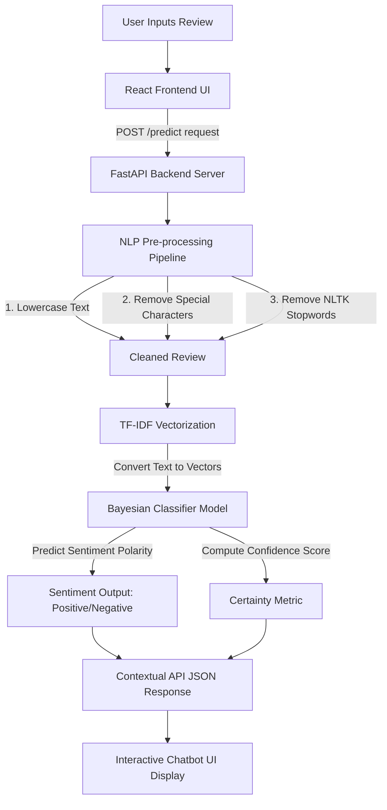

# 💬 AI Product Review Chatbot & Sentiment Analyzer

> An advanced Full-Stack Artificial Intelligence and Machine Learning application designed to analyze, classify, and compare customer reviews using Natural Language Processing (NLP) and Naive Bayes models.

---

## 🌟 Key Features

*   💬 **Interactive NLP Chatbot:** Enter raw customer reviews to perform real-time pre-processing, text vectorization, and sentiment classification. Receive a predicted label (**Positive** or **Negative**), a **Confidence Score**, and a contextual AI explanation of customer sentiment.
*   ⚖️ **Intelligent Product Comparer:** Select any two smartphones for a head-to-head comparison. The backend runs a weighted decision algorithm combining objective hardware performance (AnTuTu benchmark, **80% weight**) and customer sentiment extracted from historical reviews (Naive Bayes predicted polarity, **20% weight**) to recommend the superior device. Also extracts the top 5 most common keywords for both products.
*   📊 **Analytics Dashboard:** Visual representation of key stats, including total reviews analyzed, sentiment distribution ratios, and machine learning model metrics (Accuracy, Precision, Recall, F1).
*   📱 **Devices Showcase:** Interactive showcase of 38 popular smartphones (2023 - 2024 models) with full technical specifications (Price, Rating, Battery, Camera, Display, Processor, RAM, AnTuTu) sorted by processing power.
*   🔒 **User Authentication System:** State-based secure User Registration and Login flow to simulate modern premium application controls.
*   📜 **Review History Logs:** Automatically persists and updates your last 5 sentiment classifications in local browser storage (`localStorage`) for quick access.

---

## 🏗️ System Architecture & Data Flow

Below is the workflow showing how a customer review is processed:



---

## 💻 Tech Stack & Core Pipeline

### 1. Frontend (Client Interface)
*   **Core Library:** React.js v19
*   **Design & Layout:** TailwindCSS v3 for modern dark-mode aesthetic, sleek gradients, and glassmorphism.
*   **UI Icons:** Lucide React
*   **Animations:** Framer Motion for smooth state-based micro-animations and page transitions.
*   **Data Visualization:** Recharts for dynamic dashboard analytics.
*   **API Client:** Axios for asynchronous server requests.

### 2. Backend (API Layer)
*   **Framework:** FastAPI (Python) for asynchronous, high-performance API routing.
*   **Server Engine:** Uvicorn
*   **Data Validation:** Pydantic Models
*   **Model Deserializer:** Joblib for quick ML model caching and loading.

### 3. Machine Learning & Natural Language Processing (NLP)
*   **Classifier Algorithm:** Multinomial Naive Bayes (`MultinomialNB(alpha=0.3)`)
*   **Vectorization Scheme:** TF-IDF Vectorizer (`ngram_range=(1,2)`, `max_df=0.85`, `min_df=3`, `sublinear_tf=True`, `max_features=5000`)
*   **Text Preprocessing:** Lowercasing, regex-based cleaning (removing URLs and non-alphabetic characters), and custom NLTK stopwords filtering.
*   **Training Datasets:** Amalgamated Flipkart Mobile Reviews and public Sentiment Analysis datasets (`archive.zip` and `Dataset-SA.csv.zip`).
*   **Model Evaluation Performance:**
    *   **Accuracy:** `85.4%`
    *   **Precision:** `85.5%`
    *   **Recall:** `98.8%`
    *   **F1-Score:** `91.7%`

---

## 📂 Project Directory Structure

```text
AI_Product_Review_Chatbot/
├── backend/
│   ├── app.py                # FastAPI core API routes & pipeline functions
│   ├── products.py           # In-memory smartphone database (38 models with specs & reviews)
│   ├── model.pkl             # Serialized Multinomial Naive Bayes Model
│   ├── vectorizer.pkl        # Serialized TF-IDF Text Vectorizer
│   └── package-lock.json
├── frontend/
│   ├── public/               # Public assets & index.html
│   ├── src/
│   │   ├── components/       # Reusable components (Navbar, ChatBubble, etc.)
│   │   ├── pages/            # Page layouts (Chat, Compare, Dashboard, About, Auth)
│   │   ├── App.js            # Main application router and state
│   │   ├── index.js          # React DOM mounting
│   │   └── App.css / index.css # Premium design sheets
│   ├── package.json          # Frontend packages & script definitions
│   └── tailwind.config.js    # Styling specifications
├── datasets/                 # Training raw datasets (zip format)
├── notebooks/                # Google Colab data preprocessing and exploratory notebooks
├── Data_mining_Mini_Project.ipynb # Complete model training pipeline & evaluation metrics
├── requirements.txt          # Python backend dependencies
└── README.md                 # Project documentation (You are here)
```

---

## 🚀 Local Hosting Guide

Follow these steps to set up and run the entire application locally on your machine.

### 📋 Prerequisites
Make sure you have the following installed:
*   [Python 3.8+](https://www.python.org/downloads/)
*   [Node.js (v16+) & npm](https://nodejs.org/)

---

### 1️⃣ Set Up the Backend API (FastAPI)

1. Open your terminal (PowerShell, Command Prompt, or Bash) and navigate to the project directory:
   ```bash
   cd AI_Product_Review_Chatbot
   ```

2. Create a Python virtual environment to manage dependencies:
   ```bash
   python -m venv .venv
   ```

3. Activate the virtual environment:
   *   **Windows (PowerShell):**
       ```powershell
       .venv\Scripts\Activate.ps1
       ```
   *   **Windows (CMD):**
       ```cmd
       .venv\Scripts\activate.bat
       ```
   *   **macOS / Linux:**
       ```bash
       source .venv/bin/activate
       ```

4. Install the required Python dependencies:
   ```bash
   pip install -r requirements.txt
   ```
   *(Note: This installs FastAPI, Uvicorn, Scikit-Learn, NLTK, Pandas, and other dependencies.)*

5. Navigate to the `backend` folder and start the FastAPI server with Uvicorn:
   ```bash
   cd backend
   uvicorn app:app --reload --host 127.0.0.1 --port 8000
   ```
   *   The server will start spinning on **`http://127.0.0.1:8000`**.
   *   FastAPI will automatically download the NLTK `stopwords` corpus on its first boot.
   *   You can verify the backend is running by visiting `http://127.0.0.1:8000/` in your browser. It should return: `{"message": "AI Product Review Chatbot API Running"}`.
   *   FastAPI interactive documentation is accessible at `http://127.0.0.1:8000/docs`.

---

### 2️⃣ Set Up the Frontend (React Application)

1. Open a **new terminal window** (keep the backend server running) and navigate to the `frontend` directory:
   ```bash
   cd AI_Product_Review_Chatbot/frontend
   ```

2. Install all frontend dependencies listed in `package.json`:
   ```bash
   npm install
   ```

3. Launch the React development server:
   ```bash
   npm start
   ```
   *   The browser will automatically load the app at **`http://localhost:3000`**.
   *   If it does not load automatically, open your browser and navigate to `http://localhost:3000`.

---

### 🔑 Simulated Login Access
Since the system operates under high-fidelity simulation controls, you can use any username/email and password on the **Register** and **Login** screens to access the chatbot and analytics dashboards immediately.

---

## 🔌 API Endpoints Documentation

The FastAPI backend exposes the following RESTful API endpoints:

### 1. Welcome Status
*   **Method / Route:** `GET /`
*   **Response:**
    ```json
    {
      "message": "AI Product Review Chatbot API Running"
    }
    ```

### 2. Real-Time Sentiment Classification
*   **Method / Route:** `POST /predict`
*   **Request Body (JSON):**
    ```json
    {
      "review": "The processor is blazing fast but battery backup is slightly small."
    }
    ```
*   **Response (JSON):**
    ```json
    {
      "prediction": "Positive",
      "confidence": 0.88
    }
    ```

### 3. List Registered Products
*   **Method / Route:** `GET /products`
*   **Response (JSON):** Returns an array of smartphone names registered in `products.py`.

### 4. Products Technical Specification Sheet
*   **Method / Route:** `GET /detailed-products`
*   **Response (JSON):** Returns all registered smartphones with their technical details (price, battery, camera, display, processor, RAM, etc.), sorted by AnTuTu benchmark descending.

### 5. Head-to-Head Product Comparison
*   **Method / Route:** `POST /compare`
*   **Request Body (JSON):**
    ```json
    {
      "product1": "iPhone 15 Pro Max",
      "product2": "Samsung S24 Ultra"
    }
    ```
*   **Response (JSON):** Computes normalized performance (80%) and predicted review sentiments (20%) to recommend the winning smartphone, along with key extracted descriptors.

### 6. Performance-Based Recommendations
*   **Method / Route:** `GET /recommendations`
*   **Response (JSON):** Returns recommendations sorted by their native AnTuTu processing performance scores.

---

## 📈 Advantages & Real-World Value

1.  **Automated Feedback Loops:** Helps businesses skip reading thousands of manual text comments, automatically filtering positive praise and negative complaints.
2.  **Informed Consumer Decisions:** Provides objective specs (benchmarks) along with sentiment metrics (human reviews) to make balanced buying choices.
3.  **Real-Time NLP Preprocessing:** Demonstrates effective data mining pipelines (lowercase, punctuation stripping, stopword deletion, lemmatization, and sublinear TF weighting) on raw textual inputs.
